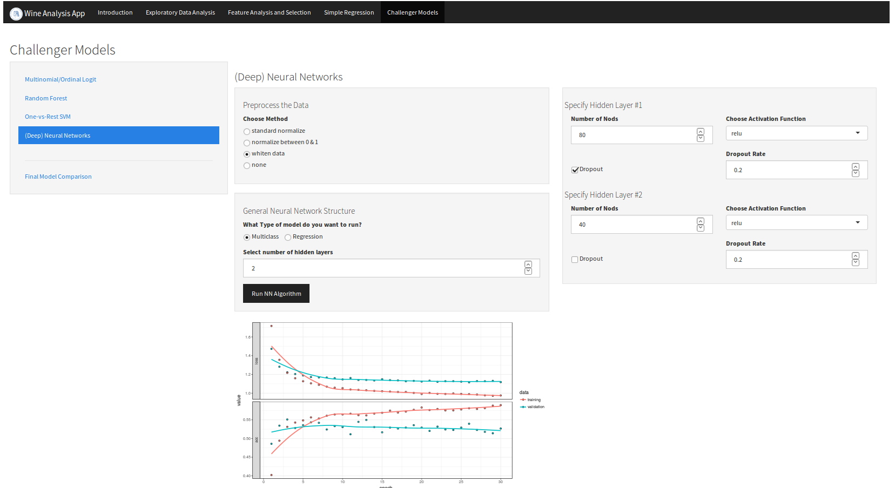

[](http://quantlet.de/)

## [](http://quantlet.de/) **SPLWineApp** [](http://quantlet.de/)

##  [Shiny App](https://flocf.shinyapps.io/Wine_App/)


```yaml

Name of QuantLet : SPLWineApp

Published in : Statistical Programming Languages - WS17/18

Description : 'Interactive shiny application to analyze wine data and predict wine quality.
Prediction model include ordered logit, multinomial logit, random forest, One-vs-Rest SVM as well
as keras (deep) neural networks. Feature selection for simple regression via Lasso regularization
possible.'

Keywords : 'shiny app, interactive, machine learning, neural network, keras, random forest,
ordered logit, multinomial logit, wine quality, Lasso, feature selection'

Author : Florian Schulz, Oliver Brose, Alex Döbele

Submitted : 2018/03/30

Datafile : winequality-red.csv, winequality-white.csv

Input : app.R, many other functions

Output : Interactive shiny application

```




### R Code:
```r
# ------------------------------------------------------------------------------
# Name of Quantlet: SPLWineApp
# ------------------------------------------------------------------------------
# Published in:     Statistical Programming Languages - WS17/18
# ------------------------------------------------------------------------------
# Description:      Interactive shiny application to analyze wine data and predict wine quality.
#                   Prediction model include ordered logit, multinomial logit, random forest, 
#                   One-vs-Rest SVM as well as keras (deep) neural networks. Feature selection
#                   for simple regression via Lasso regularization possible.
# ------------------------------------------------------------------------------
# Keywords:         shiny app, interactive, machine learning, neural network, keras,
#                   random forest, ordered logit, multinomial logit, wine quality, Lasso,
#                   feature selection
# ------------------------------------------------------------------------------
# Usage:            winequality-red.csv, winequality-white.csv, app.R, many other functions
# ------------------------------------------------------------------------------
# Output:           Interactive shiny application
# ------------------------------------------------------------------------------
# See also:         MMSTAT
# ------------------------------------------------------------------------------
# Author :          Florian Schulz, Oliver Brose, Alex Döbele
# ------------------------------------------------------------------------------

# please use 'Esc' key to jump out of the Shiny app
rm(list = ls(all = TRUE))
graphics.off()

# please set working directory setwd('C:/...')
path = "/home/flocf/Documents/git/SPL/Wine Analysis App/"
setwd(path)

# List of all needed packages
packages_needed = c("shiny", "shinythemes", "purrr", "ggplot2", "corrplot", "glmnet", "caret", "ranger",
                    "e1071", "keras", "MASS", "nnet", "plotmo", "selectiveInference")

# Check if packages need to be installed
for (pack in packages_needed) {
    if (!(as.character(pack) %in% installed.packages())) {
        message("Installing the needed package ", as.character(pack))
        install.packages(as.character(pack))
    }
}

# Load all packages
invisible(lapply(packages_needed, require, character.only = TRUE, quietly = TRUE))

# Delete list of needed packages
rm(packages_needed)

# Load necessary functions
sapply(list.files(pattern = "[.]R$", path = "Wine_App/ui_server", full.names = TRUE), source)
sapply(list.files(pattern = "[.]R$", path = "Wine_App/functions", full.names = TRUE), source)

# Run the App
runApp("Wine_App", quiet = TRUE, launch.browser = TRUE)

```
